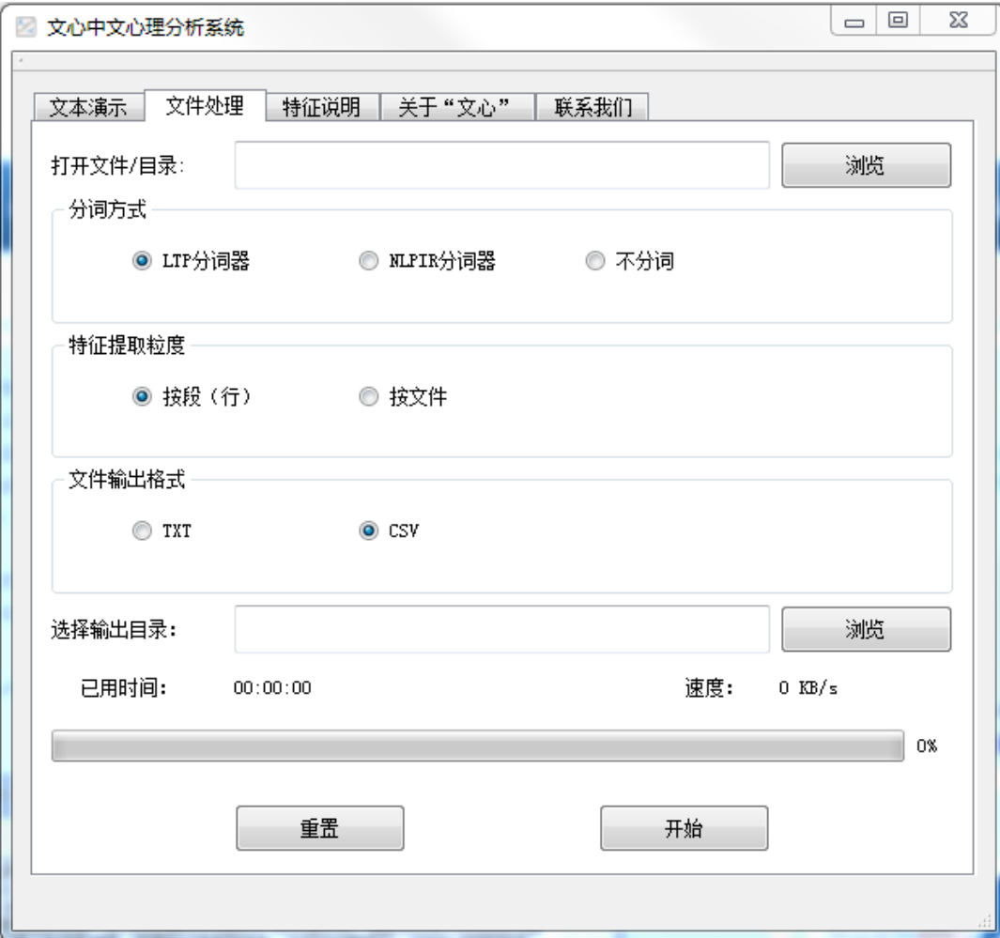

# TextMind 文心系统 · 中文心理语言分析系统

**文心（TextMind）** 是面向简体中文的心理语言分析系统，基于 LIWC（Linguistic Inquiry and Word Count）方法论，通过统计文本中不同心理语言类别的词频比例，揭示文本背后的心理特征与表达偏好。

系统搭载最新修订的 **SCLIWC2024 词典**：以 LIWC-22 英文词典为参照，在 CLIWC2015 与 SCLIWC 词典基础上，历经系统翻译、人工筛选、词向量扩展及专家校验四个阶段修订而成，共收录 **19,952 个词条**，覆盖 **116 个心理语言类别**，涵盖语言维度、心理过程、社会过程、认知过程、感知过程、个人关注等多个层面。

🌐 **在线访问**：https://cui-xt.github.io/textmind/

## 功能特性

- **文本演示**：直接输入文本（不超过 20,000 字）即时分析，结果一键导出
- **文件批量处理**：支持 TXT / CSV 文件多选批量分析（ANSI、GBK、UTF-8、Unicode 编码）
- **多种分词方式**：LTP 分词 / NLPIR 分词 / 不分词
- **灵活的特征粒度**：按行、按段（paragraph）或按文件提取特征
- **结果导出**：支持 TXT / CSV 格式
- **在线试用**：网页端使用内置示例文本在浏览器本地运行，不上传任何数据

## 下载与使用

| 资源 | 说明 |
| --- | --- |
| 文心系统完整程序包 | 含 textmind.exe、NLPIR 分词引擎及 SCLIWC2024 词典，解压即用（Windows，约 95 MB） |
| SCLIWC2024 词典 | 单独下载，19,952 词条 / 116 个心理语言类别 |

绿色版软件，无需安装，双击 `textmind.exe` 即可运行。详细使用说明与常见问题请见[在线文档](https://cui-xt.github.io/textmind/)。

## SCLIWC2024 词典

SCLIWC2024（Simplified Chinese Linguistic Inquiry and Word Count 2024）是面向简体中文的心理语言词典，旨在为中文文本的心理语义分析提供标准化工具。词典类别维度按 LIWC-22 划分为 Basic（基础）与 Expanded（扩展）两大层级，涵盖语言维度、驱动力、认知过程、情感过程、社会过程、文化、生活方式、生理、感知与相对性、时间焦点、状态与动机、会话特征等方面。

修订历经四个阶段：整合已有中文 LIWC 词典并新增 LIWC-22 类别 → 融合 LIWC-22 词典结构与新旧词更新 → 基于腾讯 AI Lab 词向量模型扩展词条 → 陈旧词清理与词典结构校验。

## 使用协议

- 本系统及词典**仅限学术研究用途**，不得用于商业目的，不得将词典的部分或全部内容转移给第三方
- 在研究成果中使用了本系统或词典，请在报告中作相应引用
- 本系统使用了 NLPIR（非商业免费）和 LTP（学术免费）等第三方组件，请同时遵守其使用协议
- 为保障用户数据隐私安全，本网站不提供在线文本分析服务；"在线试用"仅使用内置示例文本在浏览器本地运行，不会上传任何数据

## 引用

如在研究中使用了文心系统或 SCLIWC2024 词典，请引用：

> 崔雪婷, 陈思仪, 赵楠, 刘晓倩, 朱廷劭. (2024). 简体中文LIWC2024 (SCLIWC2024) 词典的修订与验证. ChinaXiv:202404.00159v1. https://psych.chinaxiv.org/abs/202404.00159

## 联系我们

- cuixt@psych.ac.cn
- tszhu@psych.ac.cn
